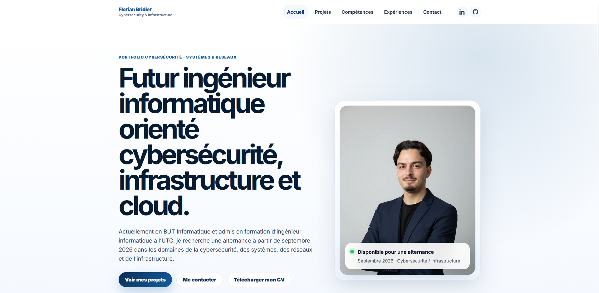
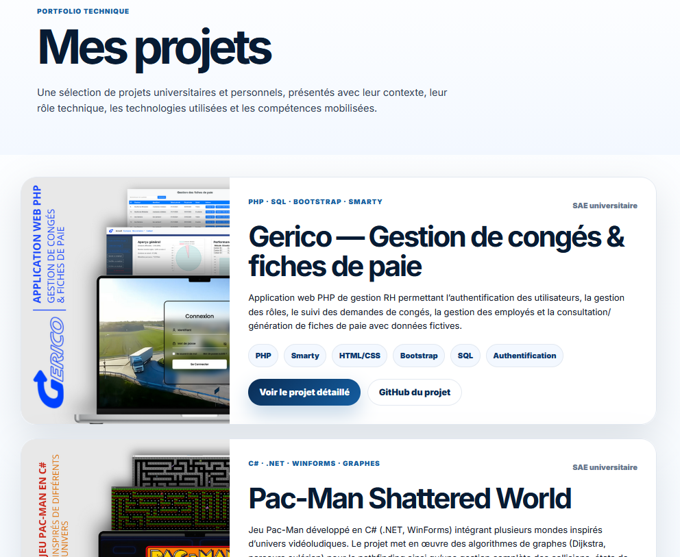
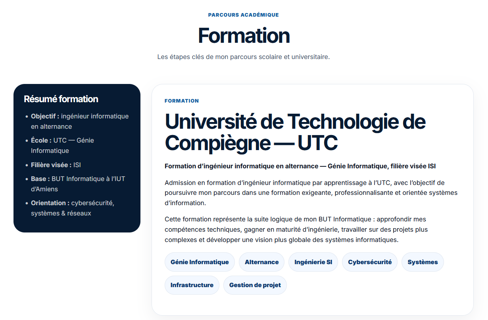
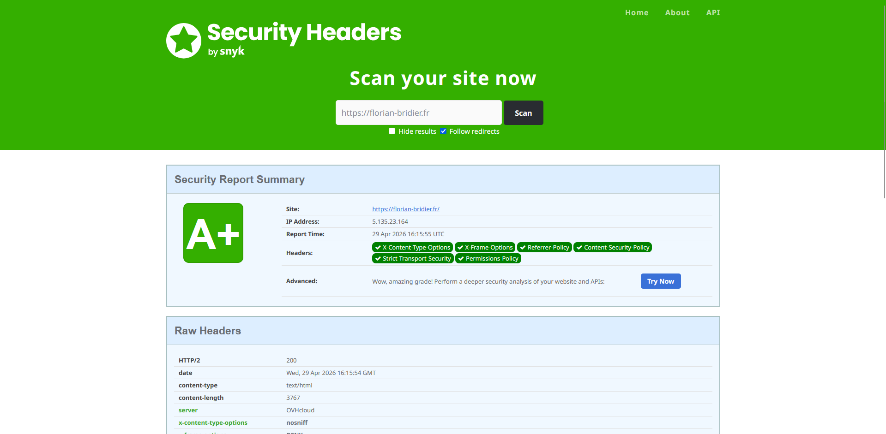

# 🌐 Portfolio – Florian Bridier

🔗 **Démo en ligne** : https://florian-bridier.fr

---

## 🎯 Présentation

Ce projet correspond à mon portfolio personnel, conçu pour présenter mon parcours, mes compétences et mes projets dans le domaine de la cybersécurité, des systèmes et des réseaux.

L’objectif est de disposer d’un support professionnel accessible en ligne, mettant en avant à la fois mes compétences techniques, mes réalisations concrètes et ma démarche de sécurisation des applications web.

---

## 🧠 Objectifs du projet

- Présenter mes projets (FitLab, Pac-Man, Gerico, Calculateur réseau)
- Mettre en valeur mes compétences techniques
- Disposer d’un support pour les candidatures en alternance
- Appliquer des bonnes pratiques de développement web
- Intégrer des mécanismes de sécurité côté client

---

## ⚙️ Technologies utilisées

- HTML5
- CSS3
- JavaScript
- Déploiement OVH

---

## 🔐 Sécurité

Une attention particulière a été portée à la sécurisation du site.

### 🔒 Mesures mises en place

- HTTPS forcé
- **Content Security Policy (CSP)** stricte
- **HSTS (Strict-Transport-Security)** avec preload
- Protection contre le clickjacking (X-Frame-Options)
- Protection contre le MIME sniffing (X-Content-Type-Options)
- Referrer Policy configurée
- Permissions Policy restrictive

### 🧪 Vérifications

Le site a été testé via :

- SecurityHeaders → **A+**
- Mozilla Observatory
- Vérification manuelle des headers HTTP

---

## 🧱 Structure du projet
portfolio/
├── index.html
├── projets.html
├── competences.html
├── parcours.html
├── contact.html
├── styles.css
├── script.js
├── assets/
└── .htaccess

---

## 💡 Points clés

- Site entièrement développé sans framework
- Design moderne et responsive
- Navigation optimisée
- Structure claire et maintenable
- Mise en production réelle
- Démarche orientée cybersécurité

---

## 📈 Ce que ce projet m’a apporté

- Déploiement d’un site web en production
- Mise en place de mesures de sécurité web concrètes
- Compréhension des headers HTTP de sécurité
- Structuration d’un projet front-end complet
- Travail sur l’expérience utilisateur et le design

---

## Aperçu du projet

### Page d'accueil
  

### Présentation des projets
  

### Récapitulatif de mes formations

### Test de sécurité [A+]

